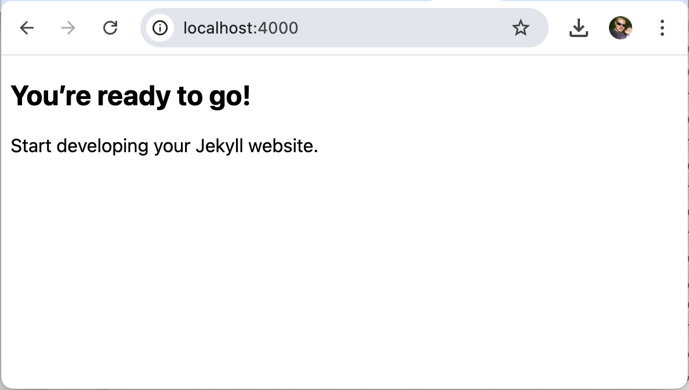

## This is a demo of very simple Jekyll site.

It utilizes the jekyll command line tool to generate a blank project without any plugins or themes.
You can use this as a starting point for your own Jekyll site.

It's a minimal setup with just the essential files to get you started quickly.

### Let's get started!

To create a new Jekyll site, you need to have Jekyll installed on your system. If you haven't done that yet, you can follow the [official installation guide](https://jekyllrb.com/docs/installation/macos/#supported-macos-versions).
Once you have Jekyll installed, you can create a new site using the command line.
If you already have Jekyll installed, you can skip the installation step.

You can create a new Jekyll site by running the following command in your terminal:

```bash
jekyll new my-awesome-site --blank
```

This will create a new directory called `my-awesome-site` with a basic Jekyll structure.

```
.
├── _config.yml
├── _data
├── _drafts
├── _includes
├── _layouts
│   └── default.html
├── _posts
├── _sass
│   └── base.scss
├── assets
│   └── css
│       └── main.scss
└── index.md
```

You can then navigate into the directory and start the Jekyll server:

```bash
cd my-awesome-site
jekyll serve
```

This will start a local server at [http://localhost:4000](http://localhost:400), where you can view your new Jekyll site.

You should see something like this:

{: width="588" }

### Customizing your site

First of all, you might want to customize the `_config.yml` file.
This file contains the configuration settings for your Jekyll site.
You can set the title, description, author, and other settings here.

```yaml
title: My Awesome Site
description: A simple Jekyll site to get you started quickly.
author:
  name: Your Name
  email: your-name@example.com
```

**Note:** Any changes to the `_config.yml` file will require you to restart the Jekyll server for them to take effect. (You can do this by pressing `Ctrl+C` in the terminal and then running `jekyll serve` again.)


#### Default layout

It's probably a good idea to create a default layout for your site.
This helps maintaining a consistent look and feel across all pages without having to repeat the same HTML structure in every file.

Thankfully, Jekyll already created a simple layout for us.
Inspect the `default.html` in the `_layouts` directory:

```html
<!DOCTYPE html>
<html lang="{{ site.lang | default: "en-US" }}">
  <head>
    <meta name="viewport" content="width=device-width, initial-scale=1">
    <meta charset="utf-8">
    <title>{{ page.title }} - {{ site.title }}</title>
    <link rel="stylesheet" href="{{ "/assets/css/main.css" | relative_url }}">
  </head>
  <body>
    {{ content }}
  </body>
</html>
```

This layout includes a `<head>` section with the page title and a link to the main stylesheet, as well as a `<body>` section that will contain the content of each page.
You can modify this layout to add your own styles, scripts, or any other HTML elements you want to include on every page.

#### Header and Footer

Let's add a header and footer to our layout.
We can do this either by editing the `default.html` file directly or by creating separate include files for the header and footer.

The latter approach gives us more flexibility and allows us to reuse the header and footer across different layouts if needed.

Create a new file called `_includes/header.html` and add the following content:

```html
<header>
  <h1>{{ site.title }}</h1>
  <nav>
    <ul>
      <li><a href="{{ "/" | relative_url }}">Home</a></li>
      <li><a href="{{ "/about" | relative_url }}">About</a></li>
      <li><a href="{{ "/contact" | relative_url }}">Contact</a></li>
    </ul>
  </nav>
</header>
```

Our header includes the Site's title and a navigation with links to the home, about, and contact pages.

Next, create a file called `_includes/footer.html` and add the following content:

```html
<footer>
  <p>&copy; {{ site.time | date: "%Y" }} {{ site.title }}. All rights reserved.</p>
  <p>Powered by <a href="https://jekyllrb.com" target="_blank">Jekyll</a>.</p>
</footer>
```

Our footer includes the current year and a link to the Jekyll website.
Now, we can include these files in our `default.html` layout by adding the following lines:

```html
<body>
  
  <hr>
  {{ content }}
  <hr>
  
</body>
```

For now, as we not yet have any styles applied, we visually separete the header and footer from the main content, by adding a horizontal rule (`<hr>`) before and after the content.

#### Adding styles

To style our site, we can create a plain old CSS file or use a preprocessor like Sass.

With the default Jekyll setup, we have a `_sass` directory where we can place our Sass files and an `assets/css` directory for the compiled CSS files.

The `assets/css/main.scss` file is already included in the `default.html` layout, and is the main stylesheet for our site. From there, we can import other Sass files or write our styles directly.

Right now, the `_sass/base.scss` file gets imported into `main.scss` by default, so we can start adding our styles there.

I'm not a design expert, so I will just add some basic styles to show how it works.

```scss
// _sass/base.scss
h1 {
  color: #6B7C59;
  font-size: 2em;
}
```

*Tipp: if you inspect this site, you'll find another css named `monokai.css`. It's purpose is to make the code samples look nice.*

### Adding Content

Let's add some content to our site.
We already have an `index.md` file, which is the homepage of our site.

In our header navigation we link to an about and a contact page, so let's create those as well.
Create a new file called `about.md` and add the following content:

```markdown
---
layout: default
title: "About"
---

## About

About me and this site.
```

Create another file called `contact.md` and add the following content:

```markdown
---
layout: default
title: "Contact & Imprint"
---

## Contact & Imprint

All the content on this site is provided by the author and is licensed under a [Creative Commons Attribution-ShareAlike 4.0 International License](https://creativecommons.org/licenses/by-sa/4.0/).

If you have any questions, suggestions or just want to say hello, feel free to contact me at:
[Contact](mailto:)

Dummy text for all the legal stuff, like imprint, privacy policy, etc.
```

### Using the Blog Feature

Jekyll also has a built-in blog feature, which allows you to create blog posts easily.
To create a blog post, you need to create a file in the `_posts` directory with a specific naming convention: `YYYY-MM-DD-title.md`.
For example, to create a blog post about Jekyll, you can create a file called `_posts/2025-06-01-jekyll.md` and add the following content:

```markdown
---
layout: default
title: "Jekyll"
date: 2025-06-01 21:53:59 +0200
categories: jekyll update
---

# Jekyll
Jekyll is a simple, blog-aware, static site generator.
Jekyll takes a template directory containing raw text files in various formats, runs it through a converter (like Markdown), and produces a complete, ready-to-publish static website suitable for serving with your favorite web server.
```

This will create a blog post with the title "Jekyll" and the date set to June 1, 2025.
You can add more blog posts by creating additional files in the `_posts` directory with the same naming convention.

Right now, the blog posts will not be displayed on the homepage, but you can create a separate page to list all blog posts.
Create a new file called `blog.md` and add the following content:

```markdown
---
layout: default
title: "Blog"
---
## Blog


  <h2><a href="{{ post.url | relative_url }}">{{ post.title }}</a></h2>
  <p>{{ post.date | date: "%B %d, %Y" }}</p>
  <p>{{ post.excerpt }}</p>

```
This will create a blog page that lists all blog posts with their titles, dates, and excerpts.
You can link to this page from the header navigation by adding a new list item in the `_includes/header.html` file:

```html
<li><a href="{{ "/blog" | relative_url }}">Blog</a></li>
```

### Not Found

Last but not least, let's create a simple 404 page that will be displayed when a user tries to access a page that doesn't exist.
Create a new file called `404.html` in the root directory and add the following content:

```html
---
title: 404 Not Found
layout: default
lang: en
permalink: /404.html
---

This is not what you are looking for.

# 404
```

This will create a simple 404 page with a title and a message.
Now, if a user tries to access a page that doesn't exist, they will be redirected to this 404 page.

### Conclusion
That's it! You now have a simple Jekyll site with a header, footer, styles, and content.
